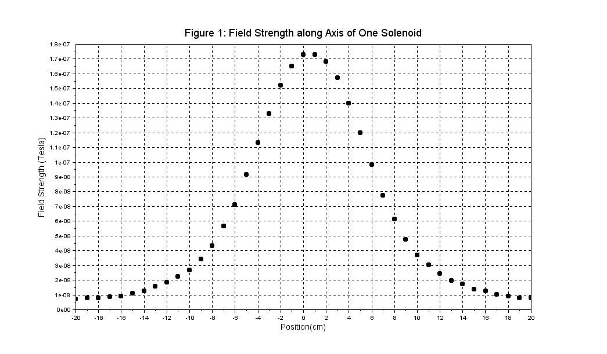

Scilab-utils
============

[Scilab](http://www.scilab.org/) is an open-source math package similar to Matlab.
I use it to make plots for my physics labs.

I'll add any little scripts I write that help with my workflow.

## quickPlot.sce
Takes data in the form of a CSV and plots it.

### Useful links
[Scilab Templates](http://www.idea2ic.com/PlayWithFink/SCILAB_Templates.html)